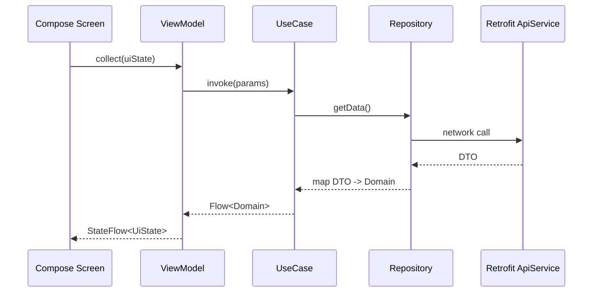
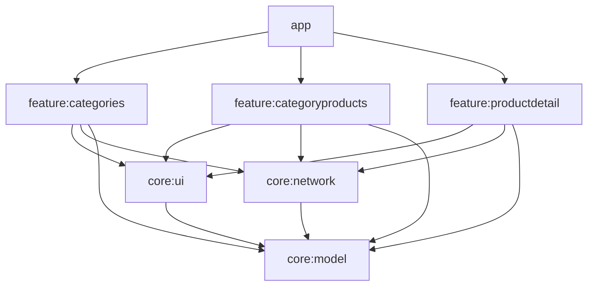

## ShoppingApp (Multi-module, Kotlin, Compose, MVVM, Hilt, Retrofit)

### Tech stack
- **Kotlin**, **Coroutines/Flow**
- **Jetpack Compose** UI, Material 3
- **MVVM**: ViewModel + UseCase + Repository
- **Navigation Compose** for routes/arguments/backstack
- **Dagger Hilt** for DI
- **Retrofit + OkHttp** (logging)

### End-to-end data flow
Sequence: API → DTO → Repository mapping → Domain → ViewModel → UI



Short Kotlin snippet (DTO → Domain mapping in a Repository):
```kotlin
val products = api.getProductsByCategory(slug).products.orEmpty()
return products.map { dto ->
  Product(
    id = dto.id ?: -1,
    title = dto.title.orEmpty(),
    description = dto.description.orEmpty(),
    price = dto.price ?: 0.0,
    discountPercentage = dto.discountPercentage ?: 0.0,
    rating = dto.rating ?: 0.0,
    stock = dto.stock ?: 0,
    brand = dto.brand.orEmpty(),
    category = dto.category.orEmpty(),
    thumbnail = dto.thumbnail.orEmpty(),
    images = dto.images.orEmpty()
  )
}
```

### Navigation structure
Routes and arguments:
- `categories`
- `categoryProducts/{category}` (arg: `category` = category slug)
- `productDetail/{id}` (arg: `id` = Int)

Back navigation result passing via `savedStateHandle`:
```kotlin
// In product detail destination
navController.previousBackStackEntry?.savedStateHandle?.set(
  ProductDetailViewModel.RESULT_SELECTED,
  true
)
navController.popBackStack()

// In the previous screen (observe once in a LaunchedEffect/VM)
val savedStateHandle = navController.currentBackStackEntry?.savedStateHandle
savedStateHandle?.getLiveData<Boolean>(ProductDetailViewModel.RESULT_SELECTED)?.observe(
  lifecycleOwner
) { selected ->
  if (selected == true) { /* react and maybe pop */ }
  savedStateHandle.set(ProductDetailViewModel.RESULT_SELECTED, null)
}
```

Mermaid graph for destinations:
```mermaid
graph TD
    A[categories] -->|select slug| B[categoryProducts/{category}]
    B -->|select product id| C[productDetail/{id}]
    C -->|result via savedStateHandle| B
```

### Dagger Hilt setup
- `@HiltAndroidApp` lives at `app/src/main/java/com/example/shoppingapp/ShoppingApp.kt`.
- Network and API providers live in `core/network`:
  - `NetworkModule`: provides `OkHttpClient` with logging, `Gson`, and `Retrofit` with `BASE_URL`.
  - `ApiModule`: provides `ProductApiService` from `Retrofit`.
  - `CoroutinesModule`: provides `@IoDispatcher CoroutineDispatcher = Dispatchers.IO`.

Example providers:
```kotlin
@Provides @Singleton
fun provideOkHttpClient(): OkHttpClient = OkHttpClient.Builder()
  .addInterceptor(HttpLoggingInterceptor().apply { level = BODY })
  .build()

@Provides @Singleton
fun provideRetrofit(gson: Gson, client: OkHttpClient): Retrofit = Retrofit.Builder()
  .baseUrl(BASE_URL)
  .client(client)
  .addConverterFactory(GsonConverterFactory.create(gson))
  .build()
```

### Libraries and SDK setup
Versions and aliases are managed in `gradle/libs.versions.toml`:
```toml
[versions]
agp = "8.7.2"
kotlin = "2.0.21"
composeBom = "2024.09.00"
retrofit = "2.11.0"
okhttp = "4.12.0"
hilt = "2.51.1"

[libraries]
retrofit = { group = "com.squareup.retrofit2", name = "retrofit", version.ref = "retrofit" }
okhttp-logging = { group = "com.squareup.okhttp3", name = "logging-interceptor", version.ref = "okhttp" }
androidx-navigation-compose = { group = "androidx.navigation", name = "navigation-compose", version = "2.8.4" }

[plugins]
android-application = { id = "com.android.application", version.ref = "agp" }
android-library = { id = "com.android.library", version.ref = "agp" }
```
Module plugins/libraries:
- `app`: application, Hilt, Navigation, Compose UI; depends on all features and cores
- `core:ui`: Compose UI toolkit and Material 3
- `core:network`: Hilt, Retrofit/OkHttp, Gson
- `core:model`: Kotlin only
- `feature:*`: Hilt, Compose, Navigation, Coil

### Module responsibilities


### Build & run
- Android Studio (Giraffe or newer), JDK 11+, Android Gradle Plugin 8.7.2
- Internet required (uses `https://dummyjson.com`)
- Run: `./gradlew :app:assembleDebug` or from Android Studio → Run app

### Developer playbook
Add an API:
1. Create DTO(s) in `core/network/dto`
2. Add endpoint to `ProductApiService`
3. Provide service via `ApiModule` if new interface
4. Map DTO→Domain inside a repository in a feature module (null-safe defaults)

Add a feature:
1. Create `feature:newfeature` module (library, Hilt, Compose)
2. Implement Repository + UseCase + ViewModel + Screen
3. Expose a `NavGraphBuilder` entry function and route const
4. Wire route in `app` NavHost

Handle back navigation result:
1. In child screen, set result on `previousBackStackEntry.savedStateHandle`
2. In parent, observe the key and react (navigate/popup)

### Error & loading handling
- Each ViewModel exposes `UiState(isLoading, data, error)` via `StateFlow`
- Show `LoadingView` during work and `ErrorView(message, onRetry)` on failures
- Map network/serialization issues to user-friendly messages in repositories

### Optional
- Testing: Use `MockWebServer` for API, unit test UseCases/Repositories; Compose UI tests for screens
- Flavors/config: add API base URL override via build config or DI qualifier
- Future: pagination, caching (Room), offline-first, more features, theming enhancements


