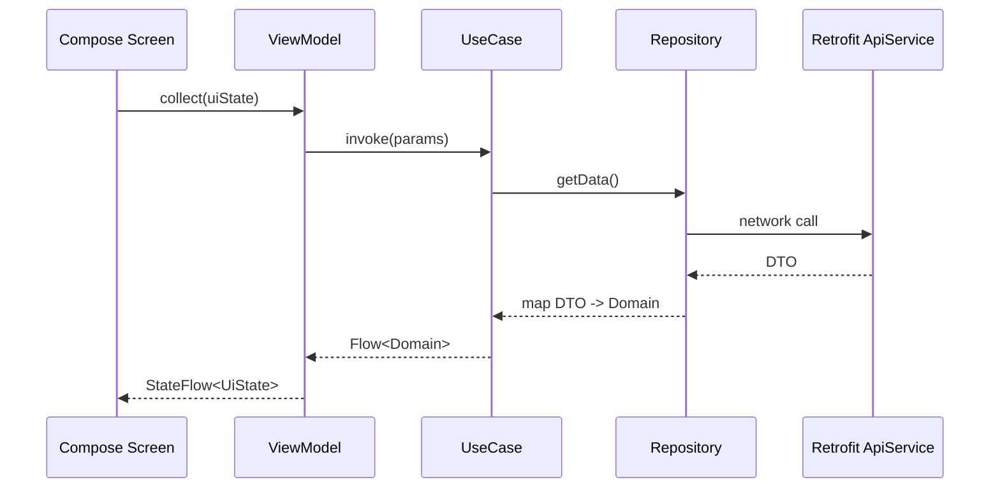
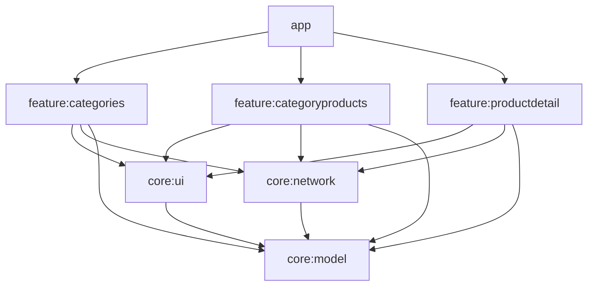

## ShoppingApp (Multi-module, Kotlin, Compose, MVVM, Hilt, Retrofit)

### Tech stack
- **Kotlin**, **Coroutines/Flow**
- **Jetpack Compose** UI, Material 3
- **MVVM**: ViewModel + UseCase + Repository
- **Navigation Compose** for routes/arguments/backstack
- **Dagger Hilt** for DI
- **Retrofit + OkHttp** (logging)

### Architecture Rationales

#### Why Multi-Module Architecture?
- **Scalability**: Each feature can be developed, tested, and maintained independently
- **Build Performance**: Gradle can compile modules in parallel, reducing build times
- **Team Collaboration**: Multiple developers can work on different modules without conflicts
- **Reusability**: Core modules can be shared across features or even other projects
- **Clear Boundaries**: Enforces separation of concerns at the module level
- **Dependency Management**: Prevents circular dependencies and ensures unidirectional data flow

#### Why Clean Architecture + MVVM?
- **Separation of Concerns**: Each layer has a single responsibility (UI, Business Logic, Data)
- **Testability**: Business logic in UseCases can be unit tested without Android dependencies
- **Maintainability**: Changes in one layer don't affect others (e.g., API changes don't affect UI)
- **Framework Independence**: Domain logic doesn't depend on Android or external frameworks
- **MVVM Benefits**: ViewModel survives configuration changes, UI is reactive to state changes

#### Why Dagger Hilt for Dependency Injection?
- **Compile-time Safety**: Detects dependency graph issues at compile time
- **Android Integration**: Built-in support for Android components (Activity, Fragment, ViewModel)
- **Performance**: No reflection at runtime, generates efficient code
- **Scoping**: Proper lifecycle management with predefined scopes (@Singleton, @ActivityScoped)
- **Testing**: Easy to provide mock dependencies for testing

#### Why Flow/StateFlow for Reactive Programming?
- **Asynchronous Data Streams**: Perfect for network calls and database operations
- **Lifecycle Awareness**: StateFlow automatically handles UI lifecycle in Compose
- **Backpressure Handling**: Flow can handle fast producers with slow consumers
- **Composability**: Easy to combine, transform, and filter data streams
- **Cold vs Hot Streams**: Flow (cold) for one-shot operations, StateFlow (hot) for UI state

#### Why DTO to Domain Mapping?
- **API Independence**: Domain models don't change when API structure changes
- **Null Safety**: Convert nullable API fields to non-null domain fields with defaults
- **Data Validation**: Sanitize and validate data at the boundary
- **Backwards Compatibility**: Can support multiple API versions with same domain models
- **Clean Models**: Domain models contain only what the app needs, not what API provides

#### Why This Module Structure (core vs feature)?
- **Core Modules**: Shared functionality that multiple features depend on
  - `core:model`: Pure Kotlin, no Android dependencies, shared by all layers
  - `core:network`: Centralized networking with consistent error handling
  - `core:ui`: Reusable UI components, consistent design system
- **Feature Modules**: Self-contained business functionality
  - Each feature owns its data layer, domain logic, and presentation
  - Can be extracted into separate libraries if needed
  - Parallel development without merge conflicts

#### Why savedStateHandle for Back Navigation Results?
- **Type Safety**: Compile-time checking of result keys and types
- **Lifecycle Aware**: Automatically handles process death and recreation
- **Navigation Independence**: Doesn't couple child screens to specific parent implementations
- **Testability**: Easy to test navigation results in ViewModels
- **Performance**: No serialization overhead, works with any data type

#### Why Jetpack Compose over Traditional Views?
- **Declarative UI**: UI is a function of state, reducing bugs from imperative updates
- **Performance**: Smart recomposition only updates changed parts of the UI
- **Less Boilerplate**: No need for findViewById, adapters, or manual state management
- **Modern Toolkit**: Built for reactive programming patterns we use elsewhere
- **Preview Support**: See UI changes instantly without running the app
- **Interoperability**: Can gradually migrate from Views if needed

### End-to-end data flow
Sequence: API → DTO → Repository mapping → Domain → ViewModel → UI



Short Kotlin snippet (DTO → Domain mapping in a Repository):
```kotlin
val products = api.getProductsByCategory(slug).products.orEmpty()
return products.map { dto ->
  Product(
    id = dto.id ?: -1,
    title = dto.title.orEmpty(),
    description = dto.description.orEmpty(),
    price = dto.price ?: 0.0,
    discountPercentage = dto.discountPercentage ?: 0.0,
    rating = dto.rating ?: 0.0,
    stock = dto.stock ?: 0,
    brand = dto.brand.orEmpty(),
    category = dto.category.orEmpty(),
    thumbnail = dto.thumbnail.orEmpty(),
    images = dto.images.orEmpty()
  )
}
```

### Navigation structure
Routes and arguments:
- `categories`
- `categoryProducts/{category}` (arg: `category` = category slug)
- `productDetail/{id}` (arg: `id` = Int)

Back navigation result passing via `savedStateHandle`:
```kotlin
// In product detail destination
navController.previousBackStackEntry?.savedStateHandle?.set(
  ProductDetailViewModel.RESULT_SELECTED,
  true
)
navController.popBackStack()

// In the previous screen (observe once in a LaunchedEffect/VM)
val savedStateHandle = navController.currentBackStackEntry?.savedStateHandle
savedStateHandle?.getLiveData<Boolean>(ProductDetailViewModel.RESULT_SELECTED)?.observe(
  lifecycleOwner
) { selected ->
  if (selected == true) { /* react and maybe pop */ }
  savedStateHandle.set(ProductDetailViewModel.RESULT_SELECTED, null)
}
```

Mermaid graph for destinations:
```mermaid
graph TD
    A[categories] -->|select slug| B[categoryProducts/{category}]
    B -->|select product id| C[productDetail/{id}]
    C -->|result via savedStateHandle| B
```

### Dagger Hilt setup
- `@HiltAndroidApp` lives at `app/src/main/java/com/example/shoppingapp/ShoppingApp.kt`.
- Network and API providers live in `core/network`:
  - `NetworkModule`: provides `OkHttpClient` with logging, `Gson`, and `Retrofit` with `BASE_URL`.
  - `ApiModule`: provides `ProductApiService` from `Retrofit`.
  - `CoroutinesModule`: provides `@IoDispatcher CoroutineDispatcher = Dispatchers.IO`.

Example providers:
```kotlin
@Provides @Singleton
fun provideOkHttpClient(): OkHttpClient = OkHttpClient.Builder()
  .addInterceptor(HttpLoggingInterceptor().apply { level = BODY })
  .build()

@Provides @Singleton
fun provideRetrofit(gson: Gson, client: OkHttpClient): Retrofit = Retrofit.Builder()
  .baseUrl(BASE_URL)
  .client(client)
  .addConverterFactory(GsonConverterFactory.create(gson))
  .build()
```

### Libraries and SDK setup
Versions and aliases are managed in `gradle/libs.versions.toml`:
```toml
[versions]
agp = "8.7.2"
kotlin = "2.0.21"
composeBom = "2024.09.00"
retrofit = "2.11.0"
okhttp = "4.12.0"
hilt = "2.51.1"

[libraries]
retrofit = { group = "com.squareup.retrofit2", name = "retrofit", version.ref = "retrofit" }
okhttp-logging = { group = "com.squareup.okhttp3", name = "logging-interceptor", version.ref = "okhttp" }
androidx-navigation-compose = { group = "androidx.navigation", name = "navigation-compose", version = "2.8.4" }

[plugins]
android-application = { id = "com.android.application", version.ref = "agp" }
android-library = { id = "com.android.library", version.ref = "agp" }
```
Module plugins/libraries:
- `app`: application, Hilt, Navigation, Compose UI; depends on all features and cores
- `core:ui`: Compose UI toolkit and Material 3
- `core:network`: Hilt, Retrofit/OkHttp, Gson
- `core:model`: Kotlin only
- `feature:*`: Hilt, Compose, Navigation, Coil

### Module responsibilities


### Build & run
- Android Studio (Giraffe or newer), JDK 11+, Android Gradle Plugin 8.7.2
- Internet required (uses `https://dummyjson.com`)
- Run: `./gradlew :app:assembleDebug` or from Android Studio → Run app

### Developer playbook
Add an API:
1. Create DTO(s) in `core/network/dto`
2. Add endpoint to `ProductApiService`
3. Provide service via `ApiModule` if new interface
4. Map DTO→Domain inside a repository in a feature module (null-safe defaults)

Add a feature:
1. Create `feature:newfeature` module (library, Hilt, Compose)
2. Implement Repository + UseCase + ViewModel + Screen
3. Expose a `NavGraphBuilder` entry function and route const
4. Wire route in `app` NavHost

Handle back navigation result:
1. In child screen, set result on `previousBackStackEntry.savedStateHandle`
2. In parent, observe the key and react (navigate/popup)

### Error & loading handling
- Each ViewModel exposes `UiState(isLoading, data, error)` via `StateFlow`
- Show `LoadingView` during work and `ErrorView(message, onRetry)` on failures
- Map network/serialization issues to user-friendly messages in repositories

### Optional
- Testing: Use `MockWebServer` for API, unit test UseCases/Repositories; Compose UI tests for screens
- Flavors/config: add API base URL override via build config or DI qualifier
- Future: pagination, caching (Room), offline-first, more features, theming enhancements

## Architecture Documentation

For detailed rationales behind architectural decisions:
- **Complete Architecture Overview**: [ARCHITECTURE.md](ARCHITECTURE.md) - Comprehensive system design rationales
- **Main Architecture Rationales**: See "Architecture Rationales" section above
- **App Module**: [app/ARCHITECTURE.md](app/ARCHITECTURE.md) - Application assembly and navigation
- **Core Modules**: Each core module has an `ARCHITECTURE.md` file explaining design decisions
  - [core:model](core/model/ARCHITECTURE.md) - Domain models and shared types
  - [core:network](core/network/ARCHITECTURE.md) - Networking infrastructure
  - [core:ui](core/ui/ARCHITECTURE.md) - Shared UI components and theming
- **Feature Modules**: Example architecture documentation in feature modules
  - [feature:categories](feature/categories/ARCHITECTURE.md) - Feature module pattern example

These documents explain the "why" behind the architectural choices, complementing the "what" and "how" covered in this README.


